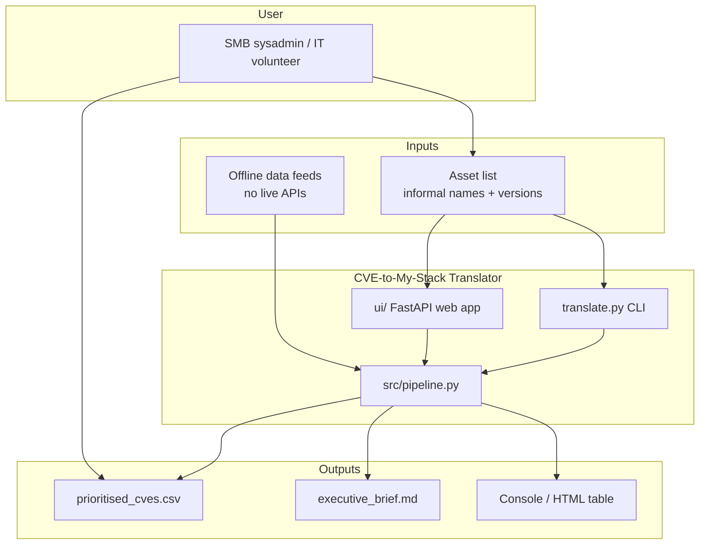
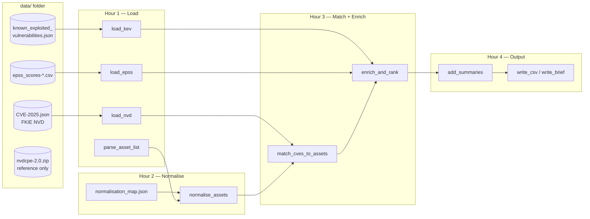
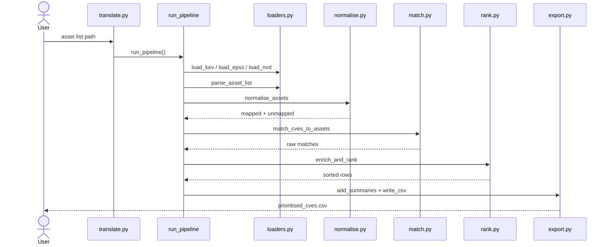
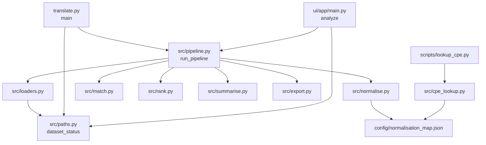
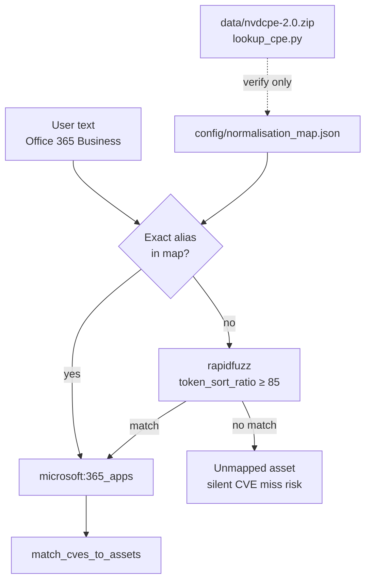
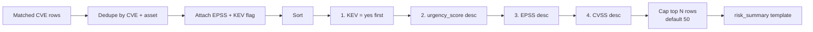
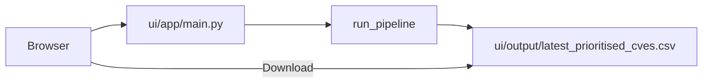

# Demo Guide — CVE-to-My-Stack Translator

Aligned with **Hackathon Guide §9 Suggested Build Approach** (5-hour build → 5-minute presentation).

**Approach:** Python data pipeline ([Approach A](PLAN.md)) + optional [Web UI](ui/README.md) (FastAPI, Jinja, Tailwind).

---

## Table of contents

1. [Before you present](#before-you-present)
2. [Architecture diagrams](#architecture-diagrams)
3. [Code & file map (clickable)](#code--file-map-clickable)
4. [Hour-by-hour build (§9)](#what-we-built-9--hour-by-hour)
5. [5-minute script](#5-minute-presentation-script)
6. [Web UI demo](#web-ui-demo-stretch)
7. [Limitations & evaluation](#limitations--state-clearly--guide-73)
8. [Commands reference](#commands-reference)

---

## Before you present

```powershell
cd c:\Users\tahir\Desktop\Hackathon2026
.\.venv\Scripts\Activate.ps1
python translate.py --brief
pytest -q
# Optional UI:
uvicorn ui.app.main:app --reload --host 127.0.0.1 --port 8000
```

**Open these files during the demo (click paths in VS Code / Cursor):**

| Role | Path |
|------|------|
| Input (facilitator list) | [data/sample_asset_list.txt](data/sample_asset_list.txt) |
| Normalisation map | [config/normalisation_map.json](config/normalisation_map.json) |
| Output CSV | [output/prioritised_cves.csv](output/prioritised_cves.csv) |
| Executive brief | [output/executive_brief.md](output/executive_brief.md) |
| CLI entrypoint | [translate.py](translate.py) |
| Pipeline orchestrator | [src/pipeline.py](src/pipeline.py) |
| This script | [DEMO.md](DEMO.md) |

---

## Architecture diagrams

### 1. System context — who and what



### 2. End-to-end data flow



### 3. Pipeline sequence (runtime)



### 4. Module dependency map



### 5. Normalisation — hardest step (detail)



### 6. Ranking logic



### 7. §9 build timeline (for slides)

```mermaid
gantt
  title Suggested 5-hour build (Hackathon §9)
  dateFormat X
  axisFormat %H:%M

  section Hour 1
  Load EPSS KEV NVD           :h1, 0, 1
  section Hour 2
  Normalisation dictionary    :h2, 1, 2
  section Hour 3
  CVE matching + EPSS/KEV     :h3, 2, 3
  section Hour 4
  Rank + CSV + summaries      :h4, 3, 4
  section Hour 5
  Tests + demo prep           :h5, 4, 5
```



---

## Code & file map (clickable)

Paths are relative to [Hackathon2026/](.). In Cursor/VS Code, **Ctrl+Click** a link to open the file. Functions link to their definition line.

### Entry points

| What | Link |
|------|------|
| CLI | [translate.py](translate.py) → [`main()`](translate.py#L77) |
| Web UI app | [ui/app/main.py](ui/app/main.py) → [`analyze()`](ui/app/main.py#L83) |
| Pipeline | [src/pipeline.py](src/pipeline.py) → [`run_pipeline()`](src/pipeline.py#L16) |
| Notebook | [starter_notebook.ipynb](starter_notebook.ipynb) |

### Hour 1 — Data loading

| Function | File |
|----------|------|
| [`load_kev()`](src/loaders.py#L13) | [src/loaders.py](src/loaders.py) |
| [`load_epss()`](src/loaders.py#L23) | [src/loaders.py](src/loaders.py) |
| [`load_nvd()`](src/loaders.py#L41) | [src/loaders.py](src/loaders.py) |
| [`parse_asset_list()`](src/loaders.py#L57) | [src/loaders.py](src/loaders.py) |
| [`smoke_test()`](src/loaders.py#L84) | [src/loaders.py](src/loaders.py) |
| [`dataset_status()`](src/paths.py#L87) | [src/paths.py](src/paths.py) |
| [`resolve_nvd_path()`](src/paths.py#L69) | [src/paths.py](src/paths.py) |

**Data files**

| Feed | Local file | Upstream |
|------|------------|----------|
| NVD CVEs | [data/CVE-2025.json](data/CVE-2025.json) | [FKIE nvd-json-data-feeds](https://github.com/fkie-cad/nvd-json-data-feeds/releases) |
| CISA KEV | [data/known_exploited_vulnerabilities.json](data/known_exploited_vulnerabilities.json) | [CISA KEV JSON](https://www.cisa.gov/sites/default/files/feeds/known_exploited_vulnerabilities.json) |
| EPSS | [data/epss_scores-2026-06-02.csv](data/epss_scores-2026-06-02.csv) | [EPSS daily scores](https://epss.empiricalsecurity.com/) |
| CPE dict | [data/nvdcpe-2.0.zip](data/nvdcpe-2.0.zip) | [NVD CPE Dictionary 2.0](https://nvd.nist.gov/vuln/data-feeds) |

**Scripts:** [scripts/download_datasets.py](scripts/download_datasets.py) · [scripts/decompress_nvd.py](scripts/decompress_nvd.py)

### Hour 2 — Normalisation

| Function | File |
|----------|------|
| [`load_normalisation_map()`](src/normalise.py#L22) | [src/normalise.py](src/normalise.py) |
| [`normalise_asset()`](src/normalise.py#L42) | [src/normalise.py](src/normalise.py) |
| [`normalise_assets()`](src/normalise.py#L88) | [src/normalise.py](src/normalise.py) |
| [`search_cpe_dictionary()`](src/cpe_lookup.py#L57) | [src/cpe_lookup.py](src/cpe_lookup.py) |

**Config:** [config/normalisation_map.json](config/normalisation_map.json)  
**CPE docs:** [data/CPE_DICTIONARY.md](data/CPE_DICTIONARY.md)  
**Lookup CLI:** [scripts/lookup_cpe.py](scripts/lookup_cpe.py)

### Hour 3 — Matching & enrich

| Function | File |
|----------|------|
| [`parse_cpe_vendor_product()`](src/match.py#L8) | [src/match.py](src/match.py) |
| [`extract_cpe_keys()`](src/match.py#L22) | [src/match.py](src/match.py) |
| [`match_cves_to_assets()`](src/match.py#L66) | [src/match.py](src/match.py) |
| [`get_cvss_score()`](src/match.py#L43) | [src/match.py](src/match.py) |
| [`enrich_and_rank()`](src/rank.py#L17) | [src/rank.py](src/rank.py) |
| [`combined_urgency_score()`](src/rank.py#L8) | [src/rank.py](src/rank.py) |

### Hour 4 — Summaries & export

| Function | File |
|----------|------|
| [`build_risk_summary()`](src/summarise.py#L16) | [src/summarise.py](src/summarise.py) |
| [`add_summaries()`](src/summarise.py#L30) | [src/summarise.py](src/summarise.py) |
| [`write_csv()`](src/export.py#L21) | [src/export.py](src/export.py) |
| [`write_brief()`](src/export.py#L51) | [src/export.py](src/export.py) |
| [`print_table()`](src/export.py#L30) | [src/export.py](src/export.py) |

### Hour 5 — Tests

| Suite | Path |
|-------|------|
| All tests | [tests/](tests/) |
| Loaders | [tests/test_loaders.py](tests/test_loaders.py) |
| Normalisation (12 samples) | [tests/test_normalise.py](tests/test_normalise.py) |
| Matching | [tests/test_match.py](tests/test_match.py) |
| Ranking / KEV order | [tests/test_rank.py](tests/test_rank.py) |
| Full pipeline | [tests/test_pipeline.py](tests/test_pipeline.py) |
| CLI | [tests/test_cli.py](tests/test_cli.py) |
| Config | [pytest.ini](pytest.ini) |

### Web UI

| Item | Link |
|------|------|
| Routes | [ui/app/main.py](ui/app/main.py) |
| Home template | [ui/templates/index.html](ui/templates/index.html) |
| Results template | [ui/templates/results.html](ui/templates/results.html) |
| Layout + Tailwind | [ui/templates/base.html](ui/templates/base.html) |
| UI readme | [ui/README.md](ui/README.md) |

---

## What we built (§9 — hour by hour)

### Hour 1 — Data loading and exploration (0:00–1:00)

**Guide objectives:** Load EPSS, KEV, NVD; explore structure; load sample assets.

| Item | Link |
|------|------|
| Loaders module | [src/loaders.py](src/loaders.py) |
| Smoke test | [`python translate.py --smoke`](translate.py) → [`smoke_test()`](src/loaders.py#L84) |
| Notebook | [starter_notebook.ipynb](starter_notebook.ipynb) |
| Download all feeds | [scripts/download_datasets.py](scripts/download_datasets.py) |

**Demo line (30s):** Offline NVD + KEV + EPSS; no API calls at runtime.

```powershell
python translate.py --smoke
```

---

### Hour 2 — Normalisation dictionary (1:00–2:00)

**Guide objectives:** CPE naming; ≥15 product map; fuzzy match; test sample list.

| Item | Link |
|------|------|
| Dictionary | [config/normalisation_map.json](config/normalisation_map.json) |
| Fuzzy logic | [`normalise_assets()`](src/normalise.py#L88) |
| CPE verify | [`python scripts/lookup_cpe.py "microsoft 365"`](scripts/lookup_cpe.py) |

**Demo line (60s):** Silent miss if alias wrong — show one map entry + live `OK -> cpe_key` lines.

---

### Hour 3 — CVE matching and filtering (2:00–3:00)

| Item | Link |
|------|------|
| CPE extract | [`extract_cpe_keys()`](src/match.py#L22) |
| Filter | [`match_cves_to_assets()`](src/match.py#L66) |
| Orchestration | [`run_pipeline()`](src/pipeline.py#L16) |

**Demo line (30s):** ~1,183 raw matches → top 50 in output.

---

### Hour 4 — Ranking and output (3:00–4:00)

| Item | Link |
|------|------|
| Sort | [`enrich_and_rank()`](src/rank.py#L17) |
| Risk text | [`build_risk_summary()`](src/summarise.py#L16) |
| CSV | [output/prioritised_cves.csv](output/prioritised_cves.csv) via [`write_csv()`](src/export.py#L21) |
| Brief | [`translate.py --brief`](translate.py) → [output/executive_brief.md](output/executive_brief.md) |

**Demo line (60s):** KEV first; read one `risk_summary` from CSV.

---

### Hour 5 — Testing and demo prep (4:00–5:00)

| Item | Link |
|------|------|
| Full run | `python translate.py data/sample_asset_list.txt --brief` |
| Tests | `pytest` → [tests/](tests/) (40 tests) |
| Demo | [DEMO.md](DEMO.md) |

---

## 5-minute presentation script

| Time | §9 | Action | Open |
|------|-----|--------|------|
| 0:00–0:30 | — | Problem: firehose → action list | [data/sample_asset_list.txt](data/sample_asset_list.txt) |
| 0:30–1:30 | H1–H2 | Pipeline diagram + normalisation | [config/normalisation_map.json](config/normalisation_map.json) · Diagram §2–§5 above |
| 1:30–3:00 | H3–H4 | Live run | `python translate.py --brief` → [output/prioritised_cves.csv](output/prioritised_cves.csv) |
| 3:00–4:00 | H5 | Tests + design | `pytest -q` · [src/pipeline.py](src/pipeline.py) |
| 4:00–5:00 | — | Limitations | Section below |

**Opening:** Five-hour §9 build — load, normalise, match, rank, export.  
**Closing:** Hardest = normalisation; value = fifty prioritised plain-English actions.

---

## Web UI demo (stretch)



```powershell
uvicorn ui.app.main:app --reload --host 127.0.0.1 --port 8000
```

Open http://127.0.0.1:8000 · Templates: [ui/templates/index.html](ui/templates/index.html) · [ui/templates/results.html](ui/templates/results.html)

---

## Limitations (state clearly — guide §7.3)

1. **Silent misses** — wrong alias in [config/normalisation_map.json](config/normalisation_map.json)
2. **EPSS** — predictive only ([`epss_label()`](src/summarise.py#L8))
3. **KEV** — absence ≠ unexploited
4. **Versions** — no range match in [`match_cves_to_assets()`](src/match.py#L66)
5. **CPE XML retired** — see [data/CPE_DICTIONARY.md](data/CPE_DICTIONARY.md)

---

## Evaluation checklist (guide §11)

| Criterion | Demonstrate with |
|-----------|------------------|
| Data pipeline | [`--smoke`](translate.py) · [`dataset_status()`](src/paths.py#L87) |
| Normalisation | [tests/test_normalise.py](tests/test_normalise.py) · 12/12 sample |
| Matching | [tests/test_match.py](tests/test_match.py) · [tests/test_pipeline.py](tests/test_pipeline.py) |
| Prioritisation | [tests/test_rank.py](tests/test_rank.py) · KEV rows top of CSV |
| Output clarity | Read [output/prioritised_cves.csv](output/prioritised_cves.csv) `risk_summary` |
| Limitations | This section |
| Tests + UI | `pytest` · [ui/app/main.py](ui/app/main.py) |

---

## Commands reference

| Command | Phase | Links |
|---------|-------|-------|
| `python scripts/download_datasets.py` | H1 | [script](scripts/download_datasets.py) |
| `python translate.py --smoke` | H1 | [translate.py](translate.py) |
| `python scripts/lookup_cpe.py "…"` | H2 | [script](scripts/lookup_cpe.py) |
| `python translate.py --brief` | H3–4 | [translate.py](translate.py) · [pipeline](src/pipeline.py) |
| `jupyter notebook starter_notebook.ipynb` | H1–4 | [notebook](starter_notebook.ipynb) |
| `pytest` | H5 | [tests/](tests/) |
| `uvicorn ui.app.main:app --reload` | UI | [ui/README.md](ui/README.md) |

---

## Slide deck tip

Export diagrams for PowerPoint:

1. Open this file in VS Code / Cursor with a Mermaid preview extension, or paste diagrams into [mermaid.live](https://mermaid.live) and export PNG/SVG.
2. Use **Diagram §1** (context) on slide 2, **§2** (data flow) on slide 3, **§5** (normalisation) when discussing the hardest step, **§6** (ranking) before showing CSV.

---

*Demo guide v3 — §9 build, clickable map, Mermaid diagrams, Web UI*
