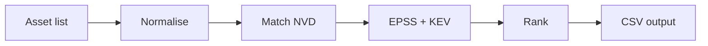

# CVE-to-My-Stack Translator — Implementation Plan

**Event:** CyberHack 2026 — Project 1  
**Duration:** 5.5 hours maximum  
**Source:** CVE-to-My-Stack Translator Hackathon Project Guide v01

---

## Goal

Take an informal asset list (product names + versions) and output a **prioritised CSV/table** of relevant CVEs with CVSS, EPSS, KEV flag, and a plain-English risk sentence.

**Hardest step:** Normalisation (informal name → CPE). Wrong mapping = CVE missing with no error.

---

## MVP checklist

- [x] Load NVD + KEV + EPSS from local files only (no live APIs)
- [x] 15–20 product aliases mapped to CPE `vendor:product`
- [x] Match CVEs to normalised assets
- [x] Rank: KEV first, then EPSS descending
- [x] Export CSV with: CVE ID, affected asset, CVSS, EPSS, KEV, risk summary
- [x] Run cleanly on facilitator `sample_asset_list.txt`

---

## Constraints

| Rule | Detail |
|------|--------|
| Data | Offline files only — no NVD/CISA/EPSS API calls |
| CVE year | Use current year JSON unless assets need older year |
| Versions | MVP ignores version ranges — match on `vendor:product` only |
| Scope | 15–20 products mapped well; accuracy over breadth |

---

## Stack & layout

**Python 3.10+** — `pandas`, `rapidfuzz`, `tabulate` (optional `flask` for stretch UI)

```
Hackathon2026/
├── data/
│   ├── CVE-2025.json
│   ├── known_exploited_vulnerabilities.json
│   ├── epss_scores-YYYY-MM-DD.csv
│   └── sample_asset_list.txt
├── config/
│   └── normalisation_map.json
├── src/
│   ├── loaders.py
│   ├── normalise.py
│   ├── match.py
│   ├── rank.py
│   ├── summarise.py
│   └── export.py
├── output/
│   └── prioritised_cves.csv
├── translate.py
├── starter_notebook.ipynb         # Exploratory demo (hackathon starter)
├── requirements.txt
└── PLAN.md
```



---

## Implementation steps

### Step 0 — Project setup

- [x] Create folder structure above (includes `starter_notebook.ipynb`)
- [x] Add `requirements.txt`: `pandas`, `rapidfuzz`, `tabulate`
- [x] Create virtualenv and install dependencies
- [x] Copy event data files into `data/` — NVD, KEV, EPSS downloaded (`scripts/download_datasets.py`)
- [x] Add `.gitignore` for large `data/*.json`

```powershell
cd c:\Users\tahir\Desktop\Hackathon2026
python -m venv .venv
.\.venv\Scripts\Activate.ps1
pip install -r requirements.txt
```

---

### Step 1 — Load offline data feeds

**File:** `src/loaders.py`

- [x] **1.1** Load CISA KEV JSON → `set` of CVE IDs (`cveID` field)
- [x] **1.2** Load EPSS CSV → `dict[cve_id] → {epss, percentile}`
- [x] **1.3** Load NVD year JSON (e.g. `CVE-2025.json`) — keep in memory or lazy iterator
- [x] **1.4** Smoke-test each loader: print counts (KEV size, EPSS rows, NVD CVE count)
- [x] **1.5** Inspect one NVD record manually — note paths for `id`, `metrics`, `configurations`, CPE `criteria`

```python
kev_ids = {v["cveID"] for v in data["vulnerabilities"]}
epss_by_cve = {row["cve"]: float(row["epss"]) for row in epss_rows}
```

**Done when:** All three feeds load without errors and sample keys look correct.

---

### Step 2 — Parse asset list input

**File:** `src/loaders.py` or `translate.py`

- [x] **2.1** Read `sample_asset_list.txt` (one product per line)
- [x] **2.2** Parse each line into `{name, version, raw_line}` (handle tab/comma/plain text)
- [x] **2.3** Return list of asset dicts for downstream steps

**Done when:** 12 sample assets parse into structured records.

---

### Step 3 — Build normalisation dictionary

**File:** `config/normalisation_map.json`

- [x] **3.1** Create entries: `aliases[]` → `vendor`, `product`, `display_name`
- [x] **3.2** Map all 12 facilitator sample products (table below)
- [x] **3.3** Add 3–8 extra SMB aliases to reach 15–20 products (Office 365, M365, Firefox, etc.)
- [ ] **3.4** Verify `vendor:product` strings against CPE dictionary (spot lookups only — do not load full XML)

| Sample product | Version | CPE target |
|----------------|---------|------------|
| Microsoft 365 Apps for Business | Current | `microsoft:365_apps` |
| Windows Server 2022 | 21H2 | `microsoft:windows_server_2022` |
| Windows 10 Pro | 22H2 | `microsoft:windows_10` |
| Adobe Acrobat Reader DC | 2024.001 | `adobe:acrobat_reader` |
| Cisco IOS XE | 17.9 | `cisco:ios_xe` |
| VMware vSphere | 8.0 | `vmware:vsphere` |
| Google Chrome | Latest | `google:chrome` |
| OpenSSL | 3.0.7 | `openssl:openssl` |
| Apache HTTP Server | 2.4.57 | `apache:http_server` |
| Zoom | 5.17 | `zoom:zoom` |
| WordPress | 6.4 | `wordpress:wordpress` |
| Moodle | 4.3 | `moodle:moodle` |

**Done when:** JSON has ≥15 products and every sample row has a matching alias.

---

### Step 4 — Implement normalisation function

**File:** `src/normalise.py`

- [x] **4.1** Load `normalisation_map.json`
- [x] **4.2** Normalise input text (lowercase, strip punctuation/extra whitespace)
- [x] **4.3** Try exact match on alias keys first
- [x] **4.4** Fall back to `rapidfuzz` best match (threshold ~85)
- [x] **4.5** Return `{user_label, vendor, product, confidence}` per asset
- [x] **4.6** Collect unmapped assets into a warning list

- [x] **4.7** Test: run all 12 sample lines — **≥10 must map correctly before Step 5**

**Done when:** Sample list normalises with expected `vendor:product` for each known product.

---

### Step 5 — Extract CPEs from NVD records

**File:** `src/match.py`

- [x] **5.1** Write `extract_cpes(cve_record)` — walk `configurations` → `nodes` → `cpeMatch` → `criteria`
- [x] **5.2** Handle missing/malformed configuration blocks gracefully
- [x] **5.3** Parse CPE string to extract `vendor:product` (from `cpe:2.3:a:vendor:product:...`)
- [x] **5.4** Unit-test on 2–3 known CVEs from notebook inspection

**Done when:** Given a CVE ID, function returns a list of `vendor:product` strings.

---

### Step 6 — Match CVEs to user assets

**File:** `src/match.py`

- [x] **6.1** Build set of target `vendor:product` from normalised assets
- [x] **6.2** Scan NVD records — if any extracted CPE contains target `vendor:product`, record match
- [x] **6.3** Attach `affected_asset` (user's original product name)
- [x] **6.4** Deduplicate by CVE ID (one row can list multiple assets if needed)
- [x] **6.5** Optional: pre-filter NVD by vendor string for speed

**MVP rule:** Ignore version numbers — substring match on `vendor:product` is enough.

**Done when:** Running on sample assets returns a non-empty, plausible CVE list (not thousands of obvious false positives).

---

### Step 7 — Enrich matches with CVSS, EPSS, KEV

**File:** `src/rank.py` (or extend `match.py`)

- [x] **7.1** For each matched CVE, lookup EPSS (default `0` if missing)
- [x] **7.2** Set `kev = cve_id in kev_ids`
- [x] **7.3** Parse CVSS from NVD metrics (`cvssMetricV31` → `V30` → `V2`, first available `baseScore`)

**Done when:** Each match row has `cve_id`, `cvss`, `epss`, `kev`, `affected_asset`.

---

### Step 8 — Rank results

**File:** `src/rank.py`

- [x] **8.1** Sort by: (1) KEV yes first, (2) EPSS descending, (3) CVSS descending
- [x] **8.2** Optional: cap output to top N rows for demo readability (e.g. 50)

**Done when:** A known KEV CVE for a sample product appears above higher-EPSS non-KEV rows.

---

### Step 9 — Generate plain-English risk summaries

**File:** `src/summarise.py`

- [x] **9.1** Map EPSS to label: `<0.10` low, `0.10–0.30` moderate, `>0.30` high
- [x] **9.2** Apply template per row:

```
CVE-{id} affects {asset}. EPSS {score} indicates {low|moderate|high} exploitation
probability. {KEV sentence}.
```

- [x] **9.3** KEV sentence: *Actively exploited in the wild (CISA KEV).* vs *Not listed in CISA KEV.*

**Done when:** Every output row has a one-sentence `risk_summary` a non-expert can read.

---

### Step 10 — Export output

**File:** `src/export.py`

- [x] **10.1** Build DataFrame / list of dicts with columns:
  - `cve_id`, `affected_asset`, `cvss`, `epss`, `kev`, `risk_summary`
- [x] **10.2** Write `output/prioritised_cves.csv`
- [x] **10.3** Print summary table to console (`tabulate`)
- [x] **10.4** Print unmapped assets warning if any

**Done when:** CSV opens cleanly and columns match MVP requirements.

---

### Step 11 — Wire CLI entrypoint

**File:** `translate.py`

- [x] **11.1** Accept asset list path as argument (default: `data/sample_asset_list.txt`)
- [x] **11.2** Chain: load feeds → parse assets → normalise → match → enrich → rank → summarise → export
- [x] **11.3** Add configurable paths for data files (args or env)

```powershell
python translate.py data\sample_asset_list.txt
```

**Done when:** Single command runs end-to-end with no manual steps.

---

### Step 12 — Test and fix

- [x] **12.1** Full run on `sample_asset_list.txt`
- [x] **12.2** Spot-check 1–2 CVEs manually (relevant product? reasonable CVSS?)
- [x] **12.3** Confirm KEV-flagged items surface at top when present
- [x] **12.4** Fix crashes, empty output, and wrong normalisation mappings
- [x] **12.5** Document known limitations for demo (silent misses, EPSS ≠ safe, no version matching)

**Done when:** Script completes without errors and output is demo-ready.

---

### Step 13 — Demo preparation (5 minutes)

- [x] **13.1** Rehearse: problem → pipeline → live run → top 3 results → limitations (see `DEMO.md`)
- [x] **13.2** Prepare to show normalisation (hardest step) with one good and one fuzzy example
- [x] **13.3** Have `prioritised_cves.csv` and console output ready

---

## Stretch steps (only after Step 12 passes)

| Step | Task |
|------|------|
| S1 | Combined urgency score: `f(cvss, epss)` | [x] `src/rank.py` |
| S2 | Version range matching on CPE version fields | [ ] |
| S3 | One-page HTML/Markdown executive brief | [x] `--brief` → `output/executive_brief.md` |
| S4 | Flask or static HTML UI uploading asset list | [ ] |
| S5 | CLI flags for year file, output path, max rows | [x] `--nvd`, `--kev`, `--epss`, `-o`, `--max-rows` |

---

## Data files reference

| File | Purpose |
|------|---------|
| `CVE-2025.json` | NVD CVE records (CPE, CVSS, descriptions) |
| `known_exploited_vulnerabilities.json` | CISA KEV — exploited CVE IDs |
| `epss_scores-*.csv` | Daily EPSS scores |
| `official-cpe-dictionary_v2.3.xml` | Reference for alias verification only |
| `sample_asset_list.txt` | Facilitator test input |

---

## Definition of done

- [x] Steps 0–13 complete
- [x] `translate.py` runs on sample asset list without errors
- [x] `output/prioritised_cves.csv` has all required columns
- [x] `normalisation_map.json` has ≥15 products
- [x] ≥10 of 12 sample products normalise correctly (12/12)
- [x] KEV entries ranked above non-KEV when both exist
- [x] Demo script + tests (`DEMO.md`, `pytest` — 37 tests)

---

## Limitations to state in demo

1. Wrong product mapping → CVE never appears (silent miss)
2. Low EPSS ≠ safe — only means lower predicted exploitation
3. Absence from KEV ≠ unexploited — may be unconfirmed
4. MVP does not match version ranges — may over-include CVEs

---

*Plan version: 1.1 — step-based implementation guide*
