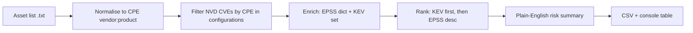

# CVE-to-My-Stack Translator — Hackathon Plan

**Event:** CyberHack 2026 — Project 1  
**Duration:** 5.5 hours maximum  
**Team size:** 3–5 participants  
**Source:** [CVE-to-My-Stack Translator Hackathon Project Guide v01](file:///c:/Users/tahir/Downloads/CVE-to-My-Stack_Translator_Hackathon_Project_Guide_v01_new.pdf)

---

## 1. Problem Statement

Every day, dozens of new CVEs are published. Small IT teams cannot read them all or determine which apply to their specific software versions and configurations.

**Core problem (one sentence):** A small IT administrator cannot filter hundreds of daily CVEs down to the few that actually affect their systems. This tool does that for them.

**Deliverable:** Given a list of software assets (informal names + versions), return a short, prioritised action list of relevant CVEs with plain-English explanations, ranked by real-world exploitability.

**Hardest part:** Normalisation — mapping informal product names to canonical CPE identifiers. Wrong mapping causes **silent misses** (no error, CVE simply absent from output).

---

## 2. Success Criteria

### MVP (required)

| # | Objective |
|---|-----------|
| 1 | Load and parse at least two offline data feeds (NVD, KEV, EPSS) |
| 2 | Normalisation dictionary: 15–20 common software names → CPE identifiers |
| 3 | Matching function: filter CVE dataset to user's asset list |
| 4 | Rank with EPSS scores and KEV flags |
| 5 | Structured output (CSV + console table) |
| 6 | Demo against facilitator sample asset list without errors |

### Required output columns

| Column | Description |
|--------|-------------|
| CVE ID | e.g. `CVE-2024-1234` |
| Affected asset | User's own product name |
| CVSS score | 0–10 severity |
| EPSS score | 0–1 exploitation probability |
| KEV flag | `yes` / `no` |
| Risk summary | One-sentence plain-English description |

### Stretch goals (if time permits)

- [ ] One-page summary brief (in addition to CSV)
- [ ] Combined CVSS + EPSS urgency score
- [ ] Version range matching (e.g. CVE affects 3.0–3.5, asset is 3.2)
- [ ] CLI accepting asset list file as argument
- [ ] Minimal Flask or HTML front end

---

## 3. Constraints

### Hard constraints

- **No external vulnerability APIs** — use only pre-downloaded local files (NVD, CISA KEV, EPSS). Internet allowed for docs/AI, not live CVE feeds.
- **5.5-hour time limit** — scope for demo readiness.
- **Current-year CVE file** unless sample assets require older years.

### Scope constraints (MVP)

- Normalisation: 15–20 products done **well**, not exhaustive coverage.
- **No version range matching** in core build — exact/substring CPE vendor:product match is sufficient.

### Known limitations (explain in demo)

| Limitation | Implication |
|------------|-------------|
| Wrong CPE mapping | CVE silently omitted from results |
| Low EPSS | Predictive only — not “safe” |
| Not in KEV | May still be exploited; not yet confirmed/reported |
| NVD enrichment gaps | Older/low-profile CVEs may lack complete CPE data |

---

## 4. Technology Choice

**Recommended: Approach A — Python data pipeline**

| Library | Purpose |
|---------|---------|
| `pandas` | Load, filter, sort CVE and EPSS data |
| `rapidfuzz` | Fuzzy matching for normalisation |
| `json`, `csv`, `gzip`, `lzma` (stdlib) | Parse feeds, decompress archives |
| `tabulate` (optional) | Console table for demo |
| `flask` (optional, stretch) | Minimal browser UI |

- Python 3.10+
- Jupyter notebook for exploration; `translate.py` for final demo
- No database — in-memory DataFrames and dicts

**Alternative:** Approach B (vanilla JS + Fuse.js + PapaParse) if team is JS-first. Mixed teams: Python pipeline + HTML reading generated CSV.

---

## 5. Architecture



### Suggested repository layout

```
Hackathon2026/
├── data/                              # Event-day files (gitignore large JSON)
│   ├── CVE-2025.json                  # Primary NVD year (or CVE-2024.json)
│   ├── known_exploited_vulnerabilities.json
│   ├── epss_scores-YYYY-MM-DD.csv
│   └── sample_asset_list.txt
├── config/
│   └── normalisation_map.json         # Aliases → vendor:product
├── src/
│   ├── loaders.py                     # NVD, KEV, EPSS
│   ├── normalise.py                   # Dictionary + fuzzy match
│   ├── match.py                       # CPE filter on NVD records
│   ├── rank.py                        # KEV + EPSS sorting
│   ├── summarise.py                   # Risk sentence templates
│   └── export.py                      # CSV + tabulate output
├── output/
│   └── prioritised_cves.csv
├── translate.py                       # CLI entrypoint
├── starter_notebook.ipynb             # Optional facilitator starter
├── requirements.txt
├── PLAN.md                            # This document
└── .gitignore
```

---

## 6. Data Feeds (offline only)

| Feed | Format | Use |
|------|--------|-----|
| NVD CVE (FKIE reconstruction) | JSON per year (`CVE-2025.json`) | Primary CVE DB: ID, description, CVSS, CPE configurations |
| CISA KEV | JSON | Set of actively exploited CVE IDs — strongest urgency signal |
| EPSS | CSV (`cve`, `epss`, `percentile`) | Dict keyed by CVE ID — O(1) lookup |
| CPE dictionary | XML/JSON | Reference only for building normalisation map — do not load fully |

### Loading patterns

```python
# KEV → set
kev_ids = {item["cveID"] for item in kev_json["vulnerabilities"]}

# EPSS → dict
epss_by_cve = {
    row["cve"]: {"epss": float(row["epss"]), "percentile": float(row["percentile"])}
    for row in epss_csv
}

# NVD — single year in memory; extract CPEs from configurations per CVE
```

**Pre-event checklist**

- [ ] Confirm which year files are on shared drive (`CVE-2024.json`, `CVE-2025.json`)
- [ ] Decompress `.xz` NVD files if needed (`xz -d -k CVE-2025.json.xz`)
- [ ] Note exact EPSS filename date
- [ ] Copy `sample_asset_list.txt` and `starter_notebook.ipynb`
- [ ] Add large `data/*.json` to `.gitignore`

---

## 7. Time-Boxed Build Schedule

| Time | Phase | Tasks |
|------|-------|-------|
| **0:00–0:30** | Setup | Copy data, `pip install`, smoke-load KEV set, EPSS dict, NVD JSON structure |
| **0:30–1:30** | Normalisation | Build 15–20 mappings; fuzzy function; **test all 12 sample assets** |
| **1:30–2:30** | Matching | Extract CPEs from NVD; filter by normalised vendor:product per asset |
| **2:30–3:30** | Enrichment | Merge EPSS; KEV flag; sort KEV first, then EPSS desc, CVSS tie-break |
| **3:30–4:30** | Output | Risk templates; CSV; console table; warn on unmapped assets |
| **4:30–5:30** | Demo prep | Full sample run; fix errors; 5-min demo script; stretch if ready |

> **Critical path:** Normalisation must handle ≥10 of 12 sample products before investing in matching polish.

---

## 8. Normalisation Dictionary

### Sample asset list (facilitator test set)

| Product name (as supplied) | Version | Target CPE (vendor:product) |
|----------------------------|---------|------------------------------|
| Microsoft 365 Apps for Business | Current | `microsoft:365_apps` |
| Windows Server 2022 | 21H2 | `microsoft:windows_server_2022` |
| Windows 10 Pro | 22H2 | `microsoft:windows_10` |
| Adobe Acrobat Reader DC | 2024.001 | `adobe:acrobat_reader` |
| Cisco IOS XE | 17.9 | `cisco:ios_xe` |
| VMware vSphere | 8.0 | `vmware:vsphere` |
| Google Chrome | Latest | `google:chrome` |
| OpenSSL | 3.0.7 | `openssl:openssl` |
| Apache HTTP Server | 2.4.57 | `apache:http_server` |
| Zoom | 5.17 | `zoom:zoom` |
| WordPress | 6.4 | `wordpress:wordpress` |
| Moodle | 4.3 | `moodle:moodle` |

### Normalisation function behaviour

1. Parse asset line → `name`, `version`, `raw_line`
2. Strip/normalise text (lowercase, trim version tokens for matching)
3. Exact match on alias keys in `normalisation_map.json`
4. Else `rapidfuzz.process.extractOne` on all aliases (threshold ~85)
5. Return `(user_label, vendor, product, confidence)`; log low-confidence matches

### Additional SMB aliases to include (reach 15–20)

Examples: `Office 365`, `M365`, `Windows Server 2019`, `Exchange`, `Teams`, `Firefox`, `Node.js`, `PostgreSQL`, `MySQL`, `nginx`, `PuTTY`, `7-Zip`, `Notepad++`

Use CPE dictionary XML for **spot lookups only** when verifying vendor:product strings.

---

## 9. CVE Matching (MVP)

**Rule:** A CVE matches an asset if any CPE in its NVD `configurations` contains the normalised `vendor:product` substring (version ignored for core build).

1. Implement `extract_cpes(cve_record)` — defensive parsing for nested `nodes` / `cpeMatch` / `criteria`
2. For each normalised asset, collect matching CVE IDs
3. Deduplicate; record which user asset(s) triggered each CVE
4. Optional: prefer `application` CPE type; filter obvious hardware-only noise

**Performance:** Pre-filter NVD by vendor list from normalised assets if full scan is slow.

---

## 10. Ranking & Risk Summaries

### Sort order

1. `KEV == yes` (top)
2. `EPSS` descending
3. `CVSS` descending (tie-break)

Default missing EPSS to `0`. Parse CVSS from first available: `cvssMetricV31` → `V30` → `V2`.

### Risk sentence template

```
CVE-{id} affects {asset}. EPSS {score} indicates {low|moderate|high} exploitation
probability. {KEV: Actively exploited in the wild (CISA KEV). | Not listed in CISA KEV.}
```

**EPSS bands (suggested):**

| EPSS range | Label |
|------------|-------|
| &lt; 0.10 | low |
| 0.10 – 0.30 | moderate |
| &gt; 0.30 | high |

---

## 11. Team Roles (3–5 people)

| Role | Responsibility |
|------|----------------|
| Data engineer | Loaders, NVD CPE extraction, performance |
| Security mapper | `normalisation_map.json`, CPE dictionary lookups, sample tests |
| Pipeline developer | Match, merge, rank, CSV export |
| Demo lead | Sample run, slides, limitations narrative |
| QA (optional) | Edge-case assets, false positive review |

---

## 12. Evaluation Criteria Alignment

| Criterion | Demo proof point |
|-----------|------------------|
| Data pipeline | Show successful load of NVD + KEV + EPSS |
| Normalisation quality | 3 fuzzy inputs → correct CPE; explain hardest step |
| Matching accuracy | Spot-check one product; discuss false positives |
| Prioritisation | KEV row above higher-EPSS non-KEV when applicable |
| Output clarity | Non-expert can act on one risk sentence |
| Limitations | Silent misses, EPSS/KEV semantics, NVD gaps |

---

## 13. 5-Minute Demo Script

1. **Problem** (30s) — CVE firehose vs SMB reality
2. **Pipeline** (60s) — diagram: assets → normalise → match → rank → CSV
3. **Live run** (2m) — `sample_asset_list.txt` → top rows in console + CSV
4. **Design choices** (60s) — normalisation dictionary, KEV-first ranking
5. **Limitations** (30s) — silent misses, EPSS ≠ safe, no version ranges in MVP

---

## 14. Definition of Done

- [ ] `translate.py` runs on `sample_asset_list.txt` without errors
- [ ] `output/prioritised_cves.csv` with all required columns
- [ ] `config/normalisation_map.json` with ≥15 products
- [ ] KEV CVEs appear at top when relevant to stack
- [ ] Unmapped assets reported in console/output metadata
- [ ] 5-minute demo rehearsed

---

## 15. Day-One Commands

```powershell
cd c:\Users\tahir\Desktop\Hackathon2026
python -m venv .venv
.\.venv\Scripts\Activate.ps1
pip install -r requirements.txt
# Copy event data files into .\data\
python translate.py data\sample_asset_list.txt
```

### requirements.txt

```
pandas>=2.0
rapidfuzz>=3.0
tabulate>=0.9
```

---

## 16. Key Terminology Reference

| Term | Definition |
|------|------------|
| **CVE** | Common Vulnerability and Exposure identifier |
| **NVD** | National Vulnerability Database — severity, CPEs, references |
| **CPE** | Common Platform Enumeration — structured product/version IDs |
| **CVSS** | Severity score 0–10 (≥9 critical) |
| **EPSS** | Exploit probability in next 30 days (0–1) |
| **KEV** | CISA catalogue of confirmed in-the-wild exploitation |
| **Normalisation** | Informal name → canonical CPE vendor:product |
| **Fuzzy matching** | Near-string match for alias resolution |

---

## 17. Risks & Mitigations

| Risk | Mitigation |
|------|------------|
| Variable NVD JSON shape | Inspect one CVE in Hour 1; defensive `extract_cpes()` |
| Slow full NVD scan | Filter by vendor list first; cap demo output to top N |
| Over-scoping | Skip version ranges and UI until CSV works |
| Silent normalisation failure | Print unmapped assets; test 12 sample lines early |
| Large repo / git | `.gitignore` for `data/*.json` |

---

## 18. Next Steps (pre-hackathon)

1. Scaffold `requirements.txt`, `config/normalisation_map.json`, and `src/` modules
2. Implement loaders against placeholder/small JSON samples
3. Rehearse normalisation tests against Section 10 sample list
4. On event day: drop real data files into `data/` and run full pipeline

---

*Plan version: 1.0 — aligned with CSE Connect CyberHack 2026 Project 1 guide v01*
