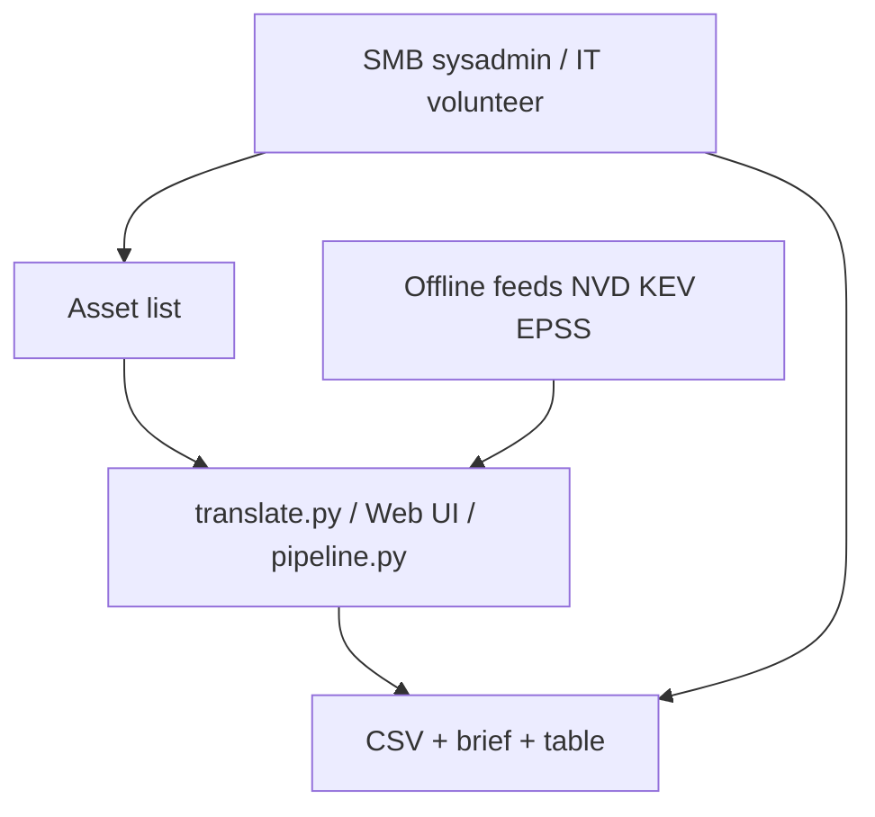
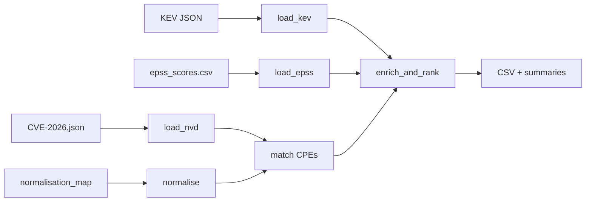
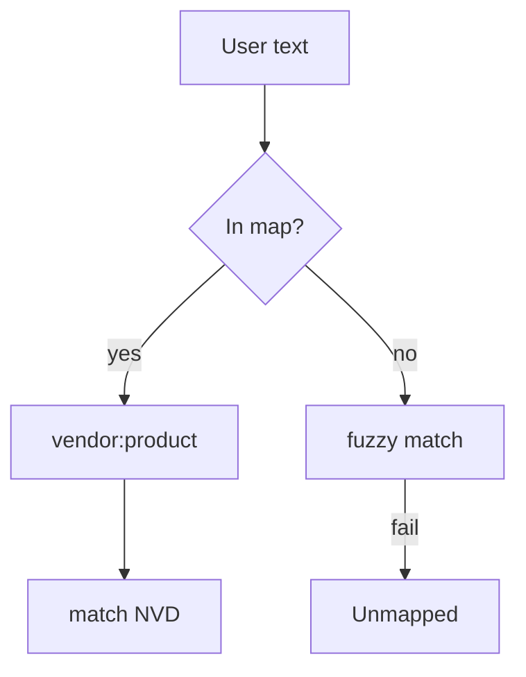
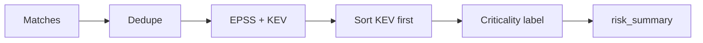

<!-- _class: lead -->
<!-- _paginate: false -->

# CVE-to-My-Stack Translator

**Demo deck from [DEMO.md](../DEMO.md)**

Python pipeline (Approach A) + Web UI · **4-minute presentation** (slides 1–10) · backup slides after

*Your name / team*

---

## Why it’s needed

- CVE **volume** exceeds what small IT teams can triage
- NVD is **global** — not filtered to **your** software stack
- Need: **what to patch first**, in plain language

> *"47 CVEs overnight — which 4 matter to us?"*

**Offline only** at runtime — no live CVE APIs during analysis

---

## Who it’s for

| User | Use case |
|------|----------|
| **SMB sysadmin** | Paste stack → patch KEV / Critical first |
| **School / uni IT** | Weekly prioritised CSV for management |
| **Charity volunteer** | One-sentence risk summaries |

---

## What we built

| Input | Output |
|-------|--------|
| Informal asset list (tab / file / web) | Top **50** prioritised CVE rows |
| e.g. Office 365 Business | CVE, asset, **criticality**, CVSS, EPSS, KEV, **risk summary** |
| CLI `translate.py` or **Web UI** | `prioritised_cves.csv` + `executive_brief.md` |

---

## System context



---

## End-to-end data flow



---

## §9 Hour 1 — Load data (0:00–1:00)

- [`load_kev`](src/loaders.py) · [`load_epss`](src/loaders.py) · [`load_nvd`](src/loaders.py)
- [`parse_asset_list`](src/loaders.py) · [`smoke_test`](src/loaders.py)
- Feeds: **CVE-2026.json**, CISA KEV, EPSS daily CSV
- Download: `python scripts/download_datasets.py`

**Demo line:** *Offline NVD + KEV + EPSS — no API calls at runtime.*

```powershell
python translate.py --smoke
```

---

## §9 Hour 2 — Normalisation (1:00–2:00)

- [`config/normalisation_map.json`](../config/normalisation_map.json) — **20** products
- [`normalise_assets`](src/normalise.py) + **rapidfuzz** (≥85% token match)
- CPE dictionary: verify only — [`lookup_cpe.py`](../scripts/lookup_cpe.py)
- Sample list: **12 / 12 mapped**

**Risk:** wrong alias → **CVE silently missing**



---

## §9 Hour 3–4 — Match, rank, export (2:00–4:00)

**Hour 3 — Match**

- [`match_cves_to_assets`](src/match.py) — CPE vendor:product filter (~6 s)
- Sample run: **~996** raw matches

**Hour 4 — Rank & export**

- Sort: **KEV → urgency → EPSS → CVSS** · cap **50** rows
- [`vulnerability_criticality`](src/rank.py) — Critical / High / Medium / Low
- [`build_risk_summary`](src/summarise.py) · [`write_csv`](src/export.py)

---

## Ranking & criticality



| Critical | High | Tie-break |
|----------|------|-----------|
| KEV + high EPSS, or CVSS ≥ 9 | KEV or CVSS ≥ 7 or EPSS ≥ 0.5 | EPSS → CVSS |

**Example:** CVE-2026-32202 — CVSS 4.3, KEV, EPSS 0.57 → **Critical**

---

## Live demo (4-minute slot)

```powershell
python translate.py data/sample_asset_list.txt --brief
```

**Or** http://127.0.0.1:8000 → Load sample → Analyse

| Result | Value |
|--------|-------|
| Mapped | 12 / 12 |
| Raw matches | ~996 |
| Shown | Top 50 |
| KEV in list | 13 |

Read **one** `risk_summary` aloud from CSV or UI

---

## Web UI

- FastAPI + Jinja + Tailwind — [`ui/app/main.py`](../ui/app/main.py)
- Filters: **criticality** + **application**
- Download CSV · NVD link per row

```powershell
uvicorn ui.app.main:app --reload --host 127.0.0.1 --port 8000
```

---

## Hour 5 — Tests & quality

- **`pytest`** — **44** automated tests
- [`tests/test_normalise.py`](../tests/test_normalise.py) — 12/12 sample products
- [`tests/test_rank.py`](../tests/test_rank.py) — KEV sorts first
- [`tests/test_pipeline.py`](../tests/test_pipeline.py) — end-to-end

**Datasets:** manual refresh — `python scripts/download_datasets.py --force`

---

## Limitations (say clearly)

1. **Silent misses** — bad alias in normalisation map  
2. **EPSS** — predictive, not proof of exploitation  
3. **Not in KEV** ≠ unexploited  
4. **No version-range** CPE matching (MVP)  
5. Feeds are **snapshots** — re-download to update  

---

## Evaluation checklist (§11)

| Criterion | Show |
|-----------|------|
| Data pipeline | `--smoke` · dataset status on UI |
| Normalisation | 12/12 sample · test_normalise |
| Matching | test_match · test_pipeline |
| Prioritisation | KEV top of CSV · criticality column |
| Output clarity | Read one risk_summary |
| Tests + UI | `pytest` · live UI or screenshot |

---

<!-- _class: backup -->

## Backup — Key files

| Role | Path |
|------|------|
| Input | `data/sample_asset_list.txt` |
| Map | `config/normalisation_map.json` |
| Pipeline | `src/pipeline.py` |
| Output | `output/prioritised_cves.csv` |
| Demo guide | `DEMO.md` |

---

<!-- _class: backup -->

## Backup — Commands

| Command | When |
|---------|------|
| `python scripts/download_datasets.py` | Refresh feeds |
| `python translate.py --smoke` | Verify data |
| `python translate.py --brief` | Full demo |
| `pytest` | Before presenting |
| `uvicorn ui.app.main:app --reload` | Web UI |

---

<!-- _class: lead -->
<!-- _paginate: false -->

# Thank you

**CVE-to-My-Stack Translator**

Questions?

[DEMO.md](../DEMO.md) · [REQUIREMENTS_VERIFICATION.md](../REQUIREMENTS_VERIFICATION.md)
